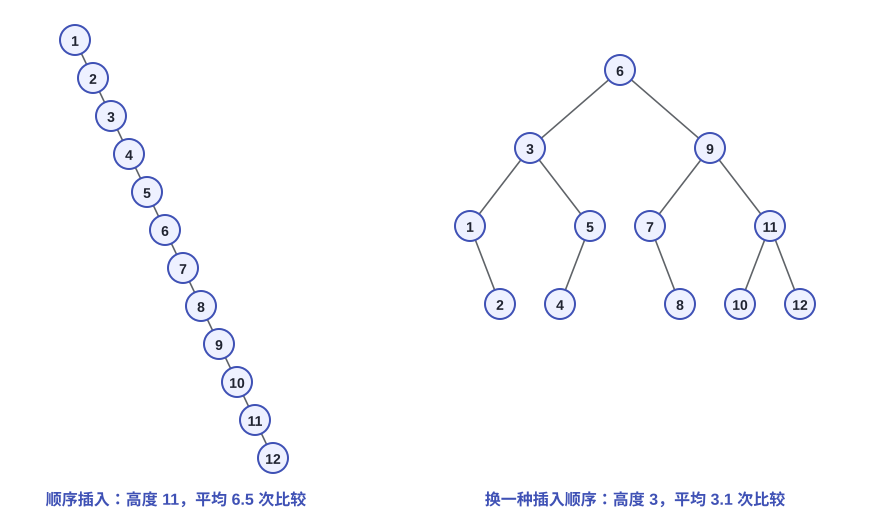
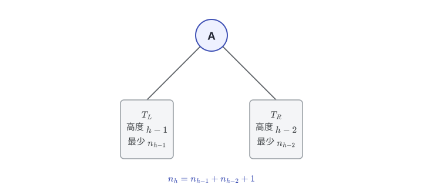
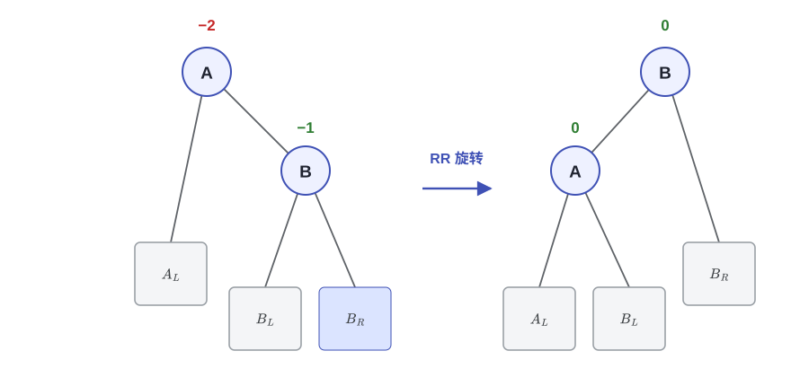
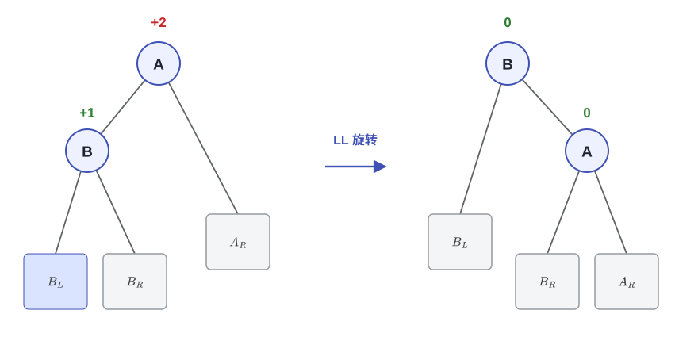
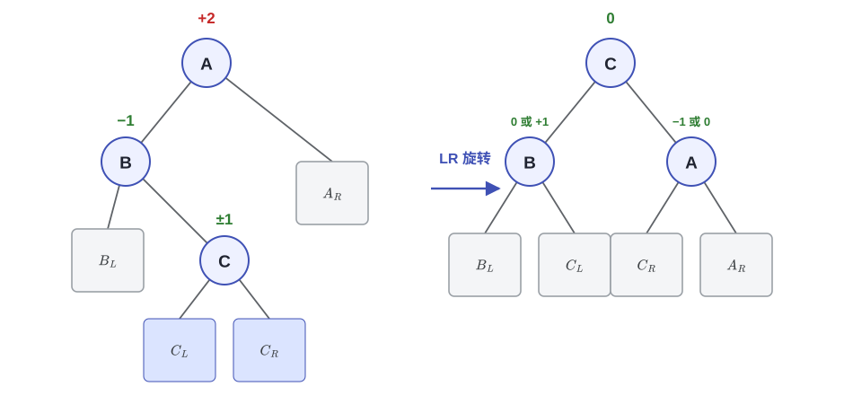
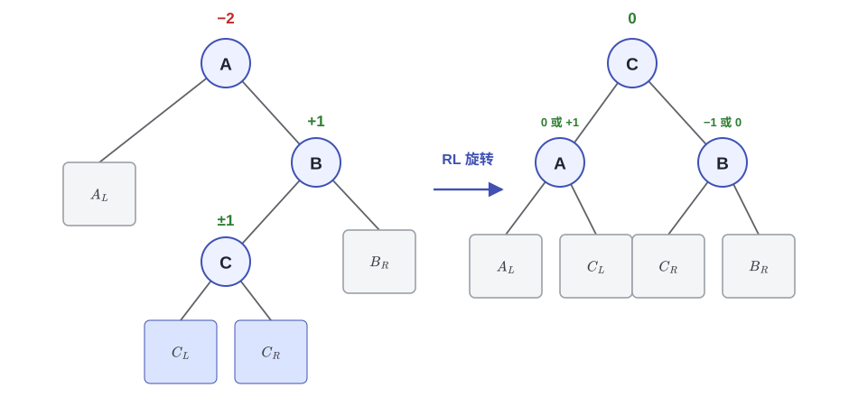
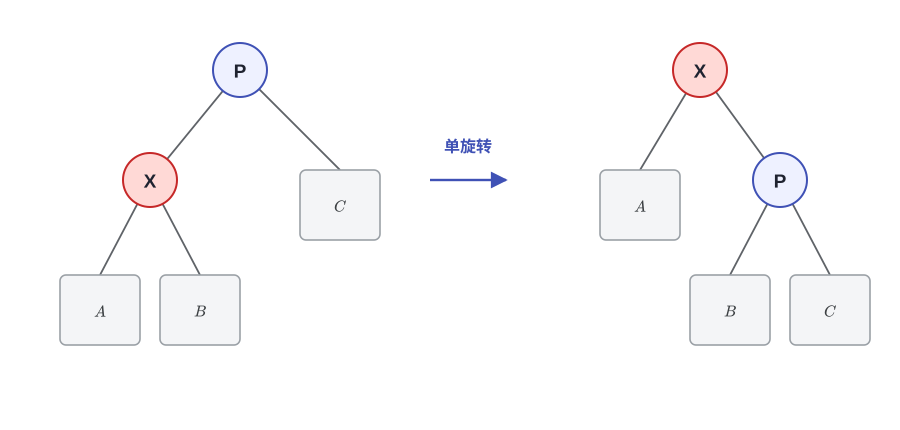
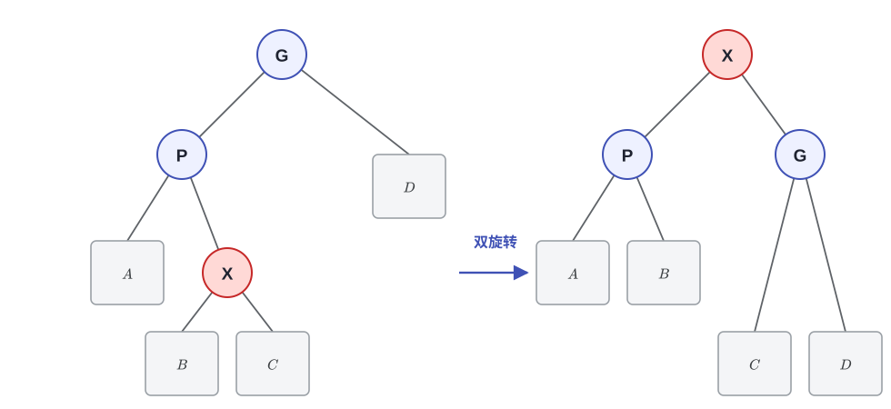
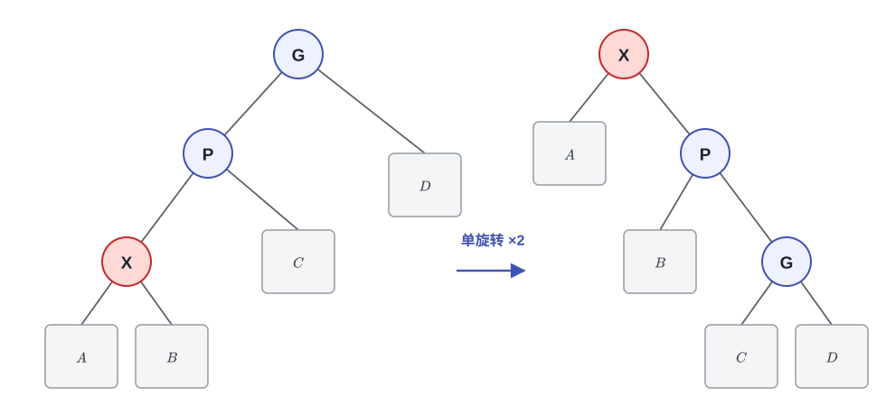

# 第一讲：AVL 树、伸展树与均摊分析

> 这一讲先看 AVL 树（AVL Trees）怎么用旋转把树高稳住 $O(\log N)$，再看伸展树（Splay Trees）怎么放弃"时刻平衡"，用均摊（amortized）的账换来更简单的实现。均摊分析（Amortized Analysis）的三种方法在最后。

---

## 1. 从二叉搜索树说起

二叉搜索树（binary search tree, BST）的查找时间是 $T_p = O(\text{height})$，而树高最坏会退化到 $O(N)$。插同一组数 $1$ 到 $12$，只换插入顺序：

| 插入顺序 | 树的样子 | 平均查找代价 |
|----------|----------|--------------|
| $1, 2, \dots, 12$ | 一条链，高度 11 | 6.5 |
| $8, 12, 5, 4, 6, 3, 1, 11, 9, 7, 10, 2$ | 高度 5，比较随意 | 3.5 |
| $6, 3, 9, 1, 5, 7, 11, 2, 4, 8, 10, 12$ | 平衡，高度 3 | 3.1 |



平均查找代价按比较次数算，也就是深度加一。12 个节点的一条链平均要 6.5 次比较，平衡下来只要 3.1 次。平衡树要解决的问题就出在这里：插入（insertion）、删除（deletion）之后用旋转（rotation）调整局部树形，让树高一直保持在 $O(\log N)$。AVL 树和伸展树是两条不同的路线。

---

## 2. AVL 树（AVL Trees）

### 2.1 定义

AVL 树由 Adelson-Velskii 与 Landis 在 1962 年提出，是最早的自平衡二叉搜索树。

> [!NOTE]
> 定义：高度平衡（height balanced）
>
> - 空二叉树是高度平衡的；
> - 若非空二叉树 $T$ 的左右子树为 $T_L$ 与 $T_R$，则 $T$ 高度平衡当且仅当：
>     1. $T_L$ 与 $T_R$ 都是高度平衡的；
>     2. $|h_L - h_R| \le 1$，其中 $h_L, h_R$ 分别为两棵子树的高度。
>
> 这里约定空树的高度为 $-1$。

平衡因子（balance factor）定义为

$$BF(node) = h_L - h_R$$

AVL 树里每个节点的平衡因子只能取 $0, \pm 1$：

| $BF$ | 含义 |
|------|------|
| $+1$ | 左子树比右子树高 1 |
| $0$ | 左右子树等高 |
| $-1$ | 右子树比左子树高 1 |

若某节点的 $|BF| \ge 2$，就以它为根做旋转，把树"扶正"。

### 2.2 树高的上界

设 $n_h$ 是高度为 $h$ 的高度平衡树中最少的节点数。想让节点数尽量少，根的两棵子树就得尽量"瘦"：一棵高度 $h-1$，另一棵高度 $h-2$，高度差恰好是 1。



于是有

$$n_h = n_{h-1} + n_{h-2} + 1, \qquad n_0 = 1,\ n_1 = 2$$

这个递推式和 Fibonacci 数列是同一个套路：

$$F_0 = 0,\quad F_1 = 1,\quad F_i = F_{i-1} + F_{i-2}\ (i > 1)$$

$$n_h = F_{h+3} - 1$$

Fibonacci 数的通项是 $F_i \approx \dfrac{1}{\sqrt{5}}\left(\dfrac{1+\sqrt{5}}{2}\right)^i$，其中 $\varphi = \dfrac{1+\sqrt5}{2}$ 是黄金分割比，代入后

$$n_h \approx \frac{1}{\sqrt5}\,\varphi^{h+3} - 1 \ \Longrightarrow\ h = O(\log N)$$

所以 $N$ 个节点的 AVL 树高度和 $\log N$ 同阶，大约 $1.44\log_2 N$，查找、插入、删除都能保证 $O(\log N)$。

### 2.3 旋转（Rotations）

插入或删除一个节点后，从修改位置往上找第一个平衡因子变成 $\pm 2$ 的节点，它就是问题发现者（trouble finder）$A$，导致它失衡的那个新节点则是问题制造者（trouble maker）。对 $A$ 做一次旋转，树就恢复了平衡。

按问题制造者相对 $A$ 的位置分四种情况：

| 情形 | 插入位置（相对 $A$） | 处理 |
|------|----------------------|------|
| **LL** | $A$ 的**左**子树的**左**子树 | 单旋转（single rotation） |
| **RR** | $A$ 的**右**子树的**右**子树 | 单旋转 |
| **LR** | $A$ 的**左**子树的**右**子树 | 双旋转（double rotation） |
| **RL** | $A$ 的**右**子树的**左**子树 | 双旋转 |

LL 和 RR、LR 和 RL 互为镜像，真正要实现的其实只有两个方向的单旋，双旋由两次单旋拼出来。

#### RR 旋转（单旋转）

按 Mar、May、Nov 的顺序插入（Mar < May < Nov），得到的是一条向右的链 Mar → May → Nov。这时 Mar 的左子树为空（高度 $-1$），右子树高度 1，$BF(\text{Mar}) = -1 - 1 = -2$。新节点 Nov 落在 Mar 的右子树的右子树里，也就是 RR 情形：



单旋转的做法是让中间层的 $B$ 升上去接替 $A$，$A$ 沉下来做 $B$ 的左子树，$B$ 原来的左子树 $B_L$ 交给 $A$ 当右子树。旋转完 $A$、$B$ 的平衡因子都回到 0。

#### LL 旋转（单旋转）

和 RR 镜像。按 May、Aug、Apr 插入：Apr 落在 Aug 的左边，May 的左子树高度 1、右子树为空（高度 $-1$），$BF(\text{May}) = 1 - (-1) = +2$。让 $B$ 升上去做子树根，$A$ 下沉当 $B$ 的右子树，树就恢复平衡了。



#### LR 旋转（双旋转）

新节点落在左子树的右边时，单旋解决不了。按 May、Aug、Mar 插入：Mar 比 Aug 大，挂在 Aug 的右边，此时 $BF(\text{May}) = +2$。如果只把 Aug 转上去，May 变成 Aug 的右子树，$BF(\text{Aug}) = -1 - 1 = -2$，还是不平衡，所以要转两次：



LR 双旋转拆成两步看：先对 $B$ 左旋，把情形变成 LL，再对 $A$ 右旋。最后 $C$ 升到子树根的位置，$B$、$A$ 做它的左右孩子。插入既可能在 $C_L$ 也可能在 $C_R$，所以 $B$、$A$ 的平衡因子要分具体情况，取 $0$ 或 $\pm 1$。

#### RL 旋转（双旋转）

方向反过来就是 RL。按 Aug、Nov、Mar 插入：Mar 比 Nov 小，挂在 Nov 的左边，$BF(\text{Aug}) = -1 - 1 = -2$，同样得双旋转：



处理和 LR 镜像：先对 $B$ 右旋，再对 $A$ 左旋，$C$ 升为子树根。

有一点要注意：插入只会在一个节点上触发旋转。插入让某个子树长高，单旋或双旋之后这棵子树的高度回到插入前的水平，更高处的祖先不会失衡，所以一次就够了。删除不一样，修好一个节点之后子树可能变矮，失衡会顺着路径继续往上走，最坏要做 $O(\log N)$ 次旋转（教材 Ch.4 有详细讨论）。

#### 平衡因子的维护

- 不需要重构（旋转）子树的时候，路径上一些节点的 $BF$ 其实也在变，更新时不能只盯着被旋转的那几个节点；
- 实现上可以给每个节点存一个高度（height）字段，用到时再用左右子树高度差算 $BF$；
- 参考资料 [1] 的 Figures 4.42–4.48 给了 AVL 节点的声明和各操作函数的写法。

把一整年插进去：按 Mar、May、Nov、Aug、Apr、Jan、Dec、July、Feb、June、Oct、Sept 的顺序插入（月份按名字的字典序比较），一共触发 6 次旋转。把月份按字典序编号成 1 到 12，用 2.4 节的代码跑一遍就能复现这张表。

| 插入 | 失衡点 | 旋转 |
|------|--------|------|
| Nov | Mar | RR 单旋转 |
| Apr | Mar | LL 单旋转 |
| Jan | May | LR 双旋转 |
| Feb | Aug | RL 双旋转 |
| June | Mar | LR 双旋转 |
| Oct | May | RR 单旋转 |

剩下 6 次（Mar、May、Aug、Dec、July、Sept）没有触发旋转，但路径上一些节点的 $BF$ 照样会变。12 个月份插完，树高是 4，根是 Jan，括号里是各节点的 $BF$：

```text
Jan(−1)
├── Dec(+1)
│   ├── Aug(+1)
│   │   └── Apr(0)
│   └── Feb(0)
└── Mar(−1)
    ├── July(−1)
    │   └── June(0)
    └── Nov(−1)
        ├── May(0)
        └── Oct(−1)
            └── Sept(0)
```

### 2.4 代码实现

节点里存一个 `height` 字段，空树高度取 $-1$。用到 `std::max`，记得 include `<algorithm>`。

```cpp
struct Node {
    int val;
    int height = 0;                 // 空树高度为 -1，叶节点为 0
    Node *left = nullptr, *right = nullptr;
};

int h(Node *p) { return p ? p->height : -1; }
int bf(Node *p) { return h(p->left) - h(p->right); }
void update(Node *p) { p->height = std::max(h(p->left), h(p->right)) + 1; }

// 把 p 的右孩子转上来，RR 用得到
Node *rotateLeft(Node *p) {
    Node *q = p->right;
    p->right = q->left;
    q->left = p;
    update(p);
    update(q);
    return q;                        // 新的子树根
}

// 把 p 的左孩子转上来，LL 用得到
Node *rotateRight(Node *p) {
    Node *q = p->left;
    p->left = q->right;
    q->right = p;
    update(p);
    update(q);
    return q;
}

// 修复以 p 为根的子树，返回新的子树根
Node *rebalance(Node *p) {
    update(p);
    if (bf(p) == 2) {                                          // 左边高：LL 或 LR
        if (bf(p->left) < 0) p->left = rotateLeft(p->left);     // LR 第一步
        return rotateRight(p);                                  // LL 或 LR 第二步
    }
    if (bf(p) == -2) {                                         // 右边高：RR 或 RL
        if (bf(p->right) > 0) p->right = rotateRight(p->right); // RL 第一步
        return rotateLeft(p);                                   // RR 或 RL 第二步
    }
    return p;
}

Node *insert(Node *p, int v) {
    if (!p) return new Node{v};
    if (v < p->val)
        p->left = insert(p->left, v);
    else if (v > p->val)
        p->right = insert(p->right, v);
    else
        return p;                        // 重复键不插入
    return rebalance(p);                 // 回溯的路上顺手修平衡
}

// 删除 v。一次删除可能一路旋转上去，对应 2.3 里的提醒
Node *erase(Node *p, int v) {
    if (!p) return nullptr;
    if (v < p->val) {
        p->left = erase(p->left, v);
    } else if (v > p->val) {
        p->right = erase(p->right, v);
    } else if (!p->left || !p->right) {  // 至多一个孩子，直接摘掉
        Node *child = p->left ? p->left : p->right;
        delete p;
        return child;
    } else {                             // 两个孩子：拿右子树的最小值顶替
        Node *suc = p->right;
        while (suc->left) suc = suc->left;
        p->val = suc->val;
        p->right = erase(p->right, suc->val);
    }
    return rebalance(p);
}
```

和前面几张图对一下：

- 两个单旋就是 `rotateLeft` 和 `rotateRight`。RR 用一个左旋，LL 用一个右旋。
- `rebalance` 里的 `bf(p->left) < 0` 就是 LR，先左旋再右旋；其他情况走 LL。右边反过来。
- 递归回溯时顺路更新高度，所以不需要父指针。

OI Wiki 的 [AVL 树](https://oi-wiki.org/ds/avl/) 页面挂了一份完整实现 [AvlTreeMap.hpp](https://github.com/OI-wiki/OI-wiki/blob/master/docs/ds/code/avl-tree/AvlTreeMap.hpp)，是个模板 Map，迭代器、contains、get、insert、erase 都齐了，想写工程一点的代码可以看那份。

---

## 3. 伸展树（Splay Trees）

### 3.1 目标与思想

伸展树的承诺是：从空树开始的任意 $M$ 次连续树操作（any M consecutive tree operations starting from an empty tree），总时间不超过 $O(M \log N)$。

它说的不是"每次操作都是 $O(\log N)$"。单次操作最坏可以到 $O(N)$，比如去访问一条退化链的末端；但均摊（amortized）到每次只有 $O(\log N)$，而且"不存在坏的输入序列"（there are no bad input sequences）。具体做法是：节点一被访问，就用一串旋转把它推到根，"自调整"（self-adjusting），最近访问过的元素下次更容易碰到。

### 3.2 朴素的"逐层单旋到根"行不通

如果每次访问完只是把被访问节点和父节点反复单旋，一步步挪到根（move-to-root），均摊界是没有保证的。按 $N, N-1, \dots, 1$ 的顺序插入，得到一条 $N$ 在根、$1$ 在最深处的左链，然后依次访问 $1, 2, \dots, N$，代价就能算出来。

先看 $N = 15$：访问 $1$ 要沿着链走 15 步，把它单旋到根之后，$2, 3, \dots, 15$ 还是串在一起的一条深 14 的链（$2$ 是 $1$ 的左孩子，$3$ 是 $2$ 的左孩子，依此类推），所以紧接着访问 $2$ 照样要走 15 步。每次访问只是把最深的那个节点搬到根，链条本身没被打散。

把比较次数和旋转次数都算成操作次数，几个规模下的总代价：

| 节点数 $N$ | 朴素单旋 | 3.3 的 splay |
|------------|----------|--------------|
| 64 | 4222 | 576 |
| 128 | 16638 | 1196 |
| 256 | 66046 | 2448 |

$N$ 翻倍，朴素做法的总次数涨到接近四倍，就是 $\Theta(N^2)$；splay 那边只涨到两倍出头，是 $O(N\log N)$。区别在于访问之后树的样子：splay 会把路径上大多数节点的深度砍掉一半，$N = 15$ 那个例子做完之后最大深度是 8，而朴素单旋做完还是 14。

### 3.3 正确的做法：三种 splay 操作

对任意非根节点 $X$，记父节点为 $P$、祖父节点为 $G$（grandparent）：

- Case 1：$P$ 就是根，旋转 $X$ 与 $P$ 即可（zig）；
- Case 2：$P$ 不是根。
    - zig-zag：$X$ 与 $P$ 方向不同（$X$ 是 $P$ 的右孩子而 $P$ 是 $G$ 的左孩子，或者镜像），做双旋转（double rotation）；
    - zig-zig：$X$ 与 $P$ 方向相同（同为左孩子或同为右孩子），先旋转 $P$ 与 $G$，再旋转 $X$ 与 $P$，也就是两次单旋。

#### zig

$P$ 是根，单旋一次，$X$ 到根。



#### zig-zag

$X$ 与 $P$ 方向相反，先转 $X$ 与 $P$，再转 $X$ 与 $G$（两次单旋方向相反）。



#### zig-zig

$X$ 与 $P$ 同向，先转 $P$ 与 $G$，再转 $X$ 与 $P$。



zig-zig 的顺序不能反：先转父亲和祖父，再把自己转上去。这是它和朴素逐层单旋唯一的不同，也是均摊 $O(\log N)$ 的关键。

splay 的效果不只是把被访问节点挪到根，路径上多数节点的深度也会大致减半（roughly halves the depth of most nodes on the path）。

再看一个例子：一条由 $1, 2, \dots, 7$ 组成的退化链，$1$ 在最深处，访问 $1$ 并把它 splay 到根之后：

```text
        1
         \
          6
         / \
        4   7
       / \
      2   5
       \
        3
```

链被折成了高度大约减半的树，后面的访问明显更快。更大的例子可以看参考资料 [1] 的 Figures 4.52–4.60，那里有 32 个节点。

### 3.4 删除（Deletion）

伸展树的删除（delete）比 AVL 省事得多：

1. Find $X$：找到 $X$ 并 splay 到根，此时 $X$ 一定在根上；
2. Remove $X$：删掉根，剩下左右两棵子树 $T_L$ 与 $T_R$；
3. FindMax($T_L$)：在左子树里找最大值，它会被 splay 到 $T_L$ 的根，且没有右孩子；
4. 拼接：把 $T_R$ 接成这个根节点的右子树。

### 3.5 代码实现

整套东西其实只有两个函数：`rotate` 把节点上旋一层，`splay` 按 3.3 的三种情况反复调用它。

```cpp
struct Node {
    int val;
    Node *left = nullptr, *right = nullptr, *parent = nullptr;
};

// 把 x 上旋一层：x 是父节点的左孩子就右旋，否则左旋
void rotate(Node *x) {
    Node *p = x->parent, *g = p->parent;
    if (p->left == x) {
        p->left = x->right;
        if (x->right) x->right->parent = p;
        x->right = p;
    } else {
        p->right = x->left;
        if (x->left) x->left->parent = p;
        x->left = p;
    }
    p->parent = x;
    x->parent = g;
    if (g) (g->left == p ? g->left : g->right) = x;
}

// 把 x 一路转到根
void splay(Node *&root, Node *x) {
    while (x->parent) {
        Node *p = x->parent, *g = p->parent;
        if (!g) {                                     // P 是根：zig
            rotate(x);
        } else if ((g->left == p) == (p->left == x)) { // X 与 P 同向：zig-zig
            rotate(p);
            rotate(x);
        } else {                                       // 异向：zig-zag
            rotate(x);
            rotate(x);
        }
    }
    root = x;
}

// 找 v。找到就把 v 转到根；没找到就把最后一个访问到的节点转到根
Node *find(Node *&root, int v) {
    Node *cur = root, *last = nullptr;
    while (cur && cur->val != v) {
        last = cur;
        cur = (v < cur->val) ? cur->left : cur->right;
    }
    Node *x = cur ? cur : last;
    if (x) splay(root, x);
    return cur;                                        // nullptr 表示没找到
}

void insert(Node *&root, int v) {
    if (!root) {
        root = new Node{v};
        return;
    }
    Node *cur = root;
    while (true) {
        if (v == cur->val) break;                      // 已存在，直接转上去
        Node *&next = (v < cur->val) ? cur->left : cur->right;
        if (!next) {
            next = new Node{v};
            next->parent = cur;
            cur = next;
            break;
        }
        cur = next;
    }
    splay(root, cur);
}

// 对应 3.4 的四步
bool erase(Node *&root, int v) {
    if (!find(root, v)) return false;
    Node *L = root->left, *R = root->right;
    if (L) L->parent = nullptr;
    if (R) R->parent = nullptr;
    delete root;
    if (!L) {
        root = R;
        return true;
    }
    Node *x = L;
    while (x->right) x = x->right;                     // FindMax(T_L)
    splay(L, x);                                       // 最大值转到 T_L 的根
    x->right = R;                                      // 接上 T_R
    if (R) R->parent = x;
    root = x;
    return true;
}
```

拿前面那条链验一下。手工造一条 $1$ 到 $7$ 的链，$1$ 在最深处，对 $1$ 调一次 `splay`，出来的就是那张图：$1$ 在根，右边是 $6$；$6$ 的左边是 $4$，右边是 $7$；$4$ 的两个孩子是 $2$ 和 $5$，$3$ 挂在 $2$ 的右边。

顺序插入 $1$ 到 $7$ 的话，每次插入后都会 splay，最后得到的是一条向左歪的链。每插一个更大的值，它都会立刻被转到根，树自然就往左长。

OI Wiki 的 [Splay 树](https://oi-wiki.org/ds/splay/) 用的是数组模拟指针的写法，维护 `fa / ch / val / cnt / sz`，代码在 [splay-1.cpp](https://github.com/OI-wiki/OI-wiki/blob/master/docs/ds/code/splay/splay-1.cpp)。那份代码还写了按排名访问、前驱、后继这些操作，想做完整平衡树的题可以直接拿来改。

### 3.6 伸展树与 AVL 树

| | AVL 树 | 伸展树 |
|------|--------|--------|
| 平衡方式 | 显式维护 $BF$/高度，用旋转修复 | 访问后 splay 到根，自调整 |
| 单次最坏时间 | $O(\log N)$ | $O(N)$ |
| 均摊时间 | $O(\log N)$ | $O(\log N)$ |
| 额外空间 | 每节点存高度或 $BF$ | 不需要 |
| 适用场景 | 要求单次操作也有保证 | 访问具有局部性、访问模式会变化 |

---

## 4. 均摊分析（Amortized Analysis）

### 4.1 三种界与三种方法

这一节要给出的是均摊时间界（amortized time bound）：任意 $M$ 次连续操作的总时间不超过 $O(M\log N)$。

三种界的强弱关系是

$$\text{worst-case bound} \ \ge\ \text{amortized bound} \ \ge\ \text{average-case bound}$$

均摊分析和概率无关（probability is not involved），给的是"总时间"的确定性上界；平均情况分析则依赖输入的概率分布。

三种方法：

| 方法 | 核心思想 |
|------|----------|
| 聚合分析（aggregate analysis） | 算总账：$n$ 次操作最坏共 $T(n)$，则均摊 $T(n)/n$ |
| 记账法（accounting method） | 每次操作"多收钱"存为信用（credit），供以后"还账" |
| 势能法（potential method） | 把信用形式化为势能函数 $\Phi$，机械化地推导 |

### 4.2 聚合分析（Aggregate Analysis）

思路是证明：对所有的 $n$，$n$ 次操作最坏情况下总共耗时 $T(n)$，均摊到每次就是 $T(n)/n$。

例子是带 $MultiPop$ 的栈（stack）：

```cpp
MultiPop(int k, Stack S)
{
    while (!IsEmpty(S) && k > 0) {
        Pop(S);
        k--;
    }
}
```

考虑初始为空的栈上 $n$ 个操作（$Push$、$Pop$、$MultiPop$ 的混合）：

- 每次 $MultiPop$ 的实际代价是 $T = \min(\text{sizeof}(S), k)$，单次可以很贵；
- 但每个元素最多被弹出一次，因为只有被压入过才可能被弹出，这是算总账的关键；
- 所以 $n$ 次操作里所有 Pop 的总次数不超过 $n$，总时间 $T(n) = O(n)$，均摊到每次是

$$T_{\text{amortized}} = O(n)/n = O(1)$$

如果只盯着单次 MultiPop 的 $O(n)$，很容易误判成 $O(n^2)$。但每个对象只会被弹出一次，总代价还是 $O(n)$。

### 4.3 记账法（Accounting Method）

做法是给每次操作定一个均摊代价 $\hat c_i$。如果 $\hat c_i$ 比实际代价 $c_i$ 大，差额就当作信用（credit）存在数据结构里的某些对象上；哪次操作入不敷出，就用存下的信用补上。

信用不能透支，对任意 $n$ 次操作都要有

$$\sum_{i=1}^{n} \hat c_i \ \ge\ \sum_{i=1}^{n} c_i$$

还是栈的例子：

| 操作 | 实际代价 $c_i$ | 均摊代价 $\hat c_i$ |
|------|----------------|---------------------|
| $Push$ | 1 | 2 |
| $Pop$ | 1 | 0 |
| $MultiPop$ | $\min(\text{sizeof}(S), k)$ | 0 |

每次 $Push$ 多收 1 个信用，存在被压入的元素上；$Pop$ 或 $MultiPop$ 弹出元素时，就用这个元素身上的信用付账。空栈的信用是 0，之后信用始终非负，所以

$$\sum_{i=1}^n \hat c_i = O(n) \ \ge\ \sum_{i=1}^n c_i,\qquad T_{\text{amortized}} = O(1)$$

### 4.4 势能法（Potential Method）

把"信用"抽象成定义在整个数据结构状态上的势能函数（potential function）$\Phi$：

- $D_i$：第 $i$ 次操作之后的数据结构；
- $c_i$：第 $i$ 次操作的实际代价；
- $\hat c_i$：第 $i$ 次操作的均摊代价。

$$\hat c_i = c_i + \Phi(D_i) - \Phi(D_{i-1})$$

于是 $n$ 次操作的总均摊代价为

$$\sum_{i=1}^{n} \hat c_i = \sum_{i=1}^{n} c_i + \Phi(D_n) - \Phi(D_0)$$

好的势能函数要在序列开始时取到最小值，一般直接取 $\Phi(D_0) = 0$。只要 $\Phi(D_n) \ge \Phi(D_0)$，就有 $\sum \hat c_i \ge \sum c_i$，均摊代价才是实际代价的上界。势能法难就难在找到合适的 $\Phi$，让估计尽量准。

栈的例子：取 $\Phi(D_i)$ 为栈中元素的个数。

| 操作 | 实际代价 $c_i$ | $\Phi(D_i) - \Phi(D_{i-1})$ | 均摊代价 $\hat c_i$ |
|------|----------------|------------------------------|---------------------|
| $Push$ | 1 | $+1$ | 2 |
| $Pop$ | 1 | $-1$ | 0 |
| $MultiPop$ | $k' = \min(\text{sizeof}(S), k)$ | $-k'$ | $k' - k' = 0$ |

每个元素的势恰好够付一次弹出，所以 $\sum \hat c_i = O(n)$。

### 4.5 伸展树的势能分析

目标是证明 $T_{\text{amortized}} = O(\log N)$。

势能函数取所有节点 rank 的和。对每个节点 $i$，记 $S(i)$ 为以 $i$ 为根的子树节点数（算上 $i$ 自己），$R(i) = \log S(i)$，则

$$\Phi(T) = \sum_{i \in T} R(i) = \sum_{i \in T} \log S(i)$$

用 rank 而不用高度，是因为 splay 里除了 $X$、$P$、$G$ 之外，其余节点的 rank 都不动。rank 只看子树大小，旋转只在三者附近做局部重排，外面的子树没变，rank 自然不变。高度就不行了，路径上各节点的高度会变，路径上方祖先的高度也可能变，推导会变得很麻烦。另外 $\Phi(T)$ 和树高同阶，正好能把旋转的代价吸收进去。

下面记操作前后的 rank 为 $R_1(\cdot)$ 和 $R_2(\cdot)$，逐个看三种情况。

zig 的实际代价是 1，只有 $X$、$P$ 的 rank 会变：

$$\hat c_i = 1 + R_2(X) - R_1(X) + R_2(P) - R_1(P) \ \le\ 1 + R_2(X) - R_1(X)$$

因为旋转后 $X$ 顶替了 $P$ 的位置（$R_2(X) = R_1(P)$），而 $P$ 从根变成非根，子树变小了（$R_2(P) \le R_1(P)$）。

zig-zag 的实际代价是 2，$X$、$P$、$G$ 的 rank 都会变：

$$\hat c_i = 2 + R_2(X) - R_1(X) + R_2(P) - R_1(P) + R_2(G) - R_1(G) \ \le\ 2\bigl(R_2(X) - R_1(X)\bigr)$$

推导分三步。旋转前后这棵子树的总节点数不变，所以 $R_1(G) = R_2(X)$，代进去消掉这两项：

$$\hat c_i = 2 - R_1(X) + R_2(P) - R_1(P) + R_2(G)$$

旋转后 $P$、$G$ 都成了 $X$ 的后代，有 $S_2(P) + S_2(G) \le S_2(X)$，套用参考资料 [1] 的 Lemma 11.4（p.448）

> 若 $a + b \le c$，则 $\log a + \log b \le 2\log c - 2$。

就得到 $R_2(P) + R_2(G) \le 2R_2(X) - 2$。再代回去，用 $R_1(P) \ge R_1(X)$ 放缩：

$$\hat c_i \le 2R_2(X) - R_1(X) - R_1(P) \le 2\bigl(R_2(X) - R_1(X)\bigr)$$

zig-zig 的结论是

$$\hat c_i \le 3\bigl(R_2(X) - R_1(X)\bigr)$$

推导的路子和 zig-zag 一样，先消掉 $R_2(X)$ 与 $R_1(G)$，再用 Lemma 11.4 压缩 rank 之和，这里就不展开了。

三种情况合起来，就得到本讲最重要的结论：在一棵根为 $T$ 的伸展树上，对节点 $X$ 做一次 splay 的均摊时间是

$$3\bigl(R(T) - R(X)\bigr) + 1 = O(\log N)$$

从空树开始的 $M$ 次操作：设第 $i$ 次操作前后的树为 $T_{i-1}$、$T_i$，则

$$\sum_{i=1}^{M} c_i = \sum_{i=1}^{M} \hat c_i + \Phi(T_0) - \Phi(T_M) \ \le\ \sum_{i=1}^{M} \hat c_i = O(M\log N)$$

从空树开始有 $\Phi(T_0) = 0$，而 $\Phi(T_M) \ge 0$，这就是伸展树的均摊界。

还有一个容易被问到的点：势能法说每次操作的均摊成本是 $O(\log N)$，这和"访问链末端要 $O(N)$"矛盾吗？不矛盾。势能法给的是 $\hat c_i = O(\log N)$，而链末端节点的实际代价可以是 $c_i = O(N)$，差额被势能的下降吃掉了，树本身也变得更平衡。均摊界说的是总时间，不是某一次操作的最坏时间。

---

## 参考资料

1. M. A. Weiss, *Data Structure and Algorithm Analysis in C* (2nd Edition): Ch.4（p.106–128，AVL 树），Ch.11（p.447–451，伸展树与均摊分析）。
2. T. H. Cormen, C. E. Leiserson, R. L. Rivest, C. Stein, *Introduction to Algorithms* (3rd Edition): Ch.17（p.451–478，均摊分析）。
3. 课程资料：第一讲课件《AVL Trees, Splay Trees, and Amortized Analysis》，以及 Splay 均摊分析的补充材料。
4. [OI Wiki](https://oi-wiki.org/)：[AVL 树](https://oi-wiki.org/ds/avl/)、[Splay 树](https://oi-wiki.org/ds/splay/)。本讲的两份代码参考了这两个页面。
