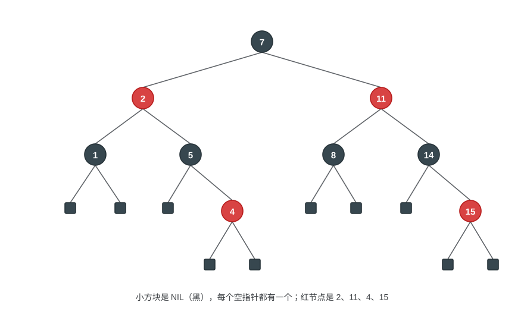
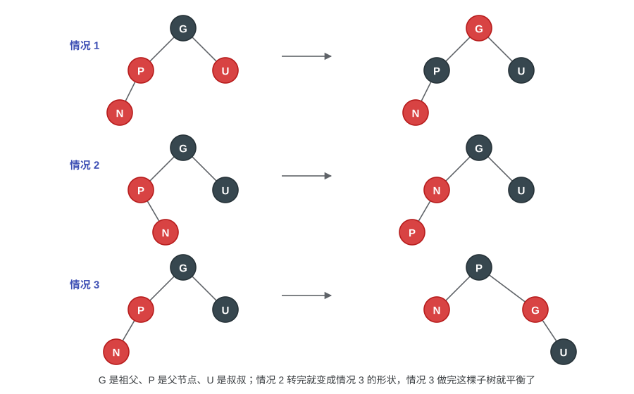
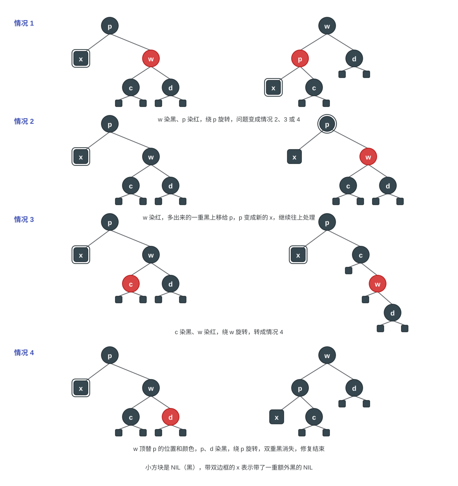
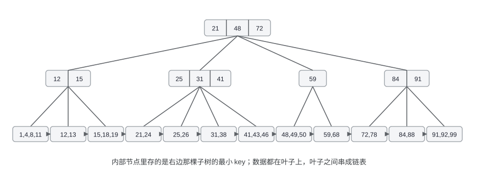
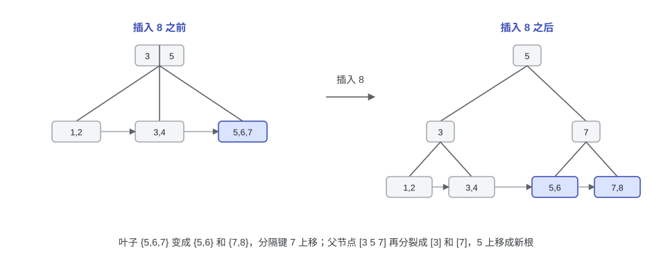
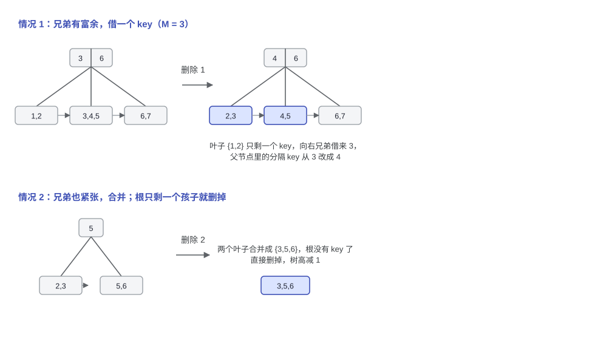

# 第二讲：红黑树与 B+ 树

> 上一讲的 AVL 树用高度差卡平衡，代价是删除时可能要一路旋转。这一讲的两个结构换了思路：红黑树用颜色把树高压在 $2\log N$ 以内，换更少的旋转；B+ 树干脆不做二叉树，把节点做宽，树高只跟 $\log_M N$ 有关。前者是 `std::map`、`TreeMap` 这类有序容器的实现基础，后者是数据库和文件系统索引的常客。

---

## 1. 红黑树（Red-Black Trees）

### 1.1 定义与性质

红黑树的目标和 AVL 树一样，也是一棵平衡的二叉搜索树，只是判平衡的标准从"高度差"换成了"颜色"。每个节点多存一个 `color` 字段（RED 或 BLACK），节点结构大致是 `parent / color / key / left / right`，**空指针统一看作 NIL 节点**。

> [!NOTE]
> **定义：红黑性质（red-black properties）**
>
> 1. 每个节点不是红的就是黑的；
> 2. 根节点是黑的；
> 3. 每个叶子（NIL）是黑的；
> 4. 红节点的两个孩子都是黑的；
> 5. 从任一节点出发，到它所有后代叶子的简单路径上，黑节点数目相同。

第五条保证了从根到任何叶子的路径长度不会相差太多。

对带 key 的节点叫内部节点（internal node），NIL 叫外部节点（external node）。



上面这棵树里，红节点（2、11、4、15）的孩子都是黑的，从根到任意一个 NIL，路径上都有 2 个黑节点（不含根自己）。

### 1.2 黑高与树高上界

AVL 树考虑的是字面意义的高度平衡，那么红黑树考虑的则是黑色节点的数量的平衡，也被称为**黑高**。

> [!NOTE]
> **黑高（black-height）**
>
> $bh(x)$ 是从节点 $x$ 出发（不含 $x$ 自己）到叶子的任意一条简单路径上的黑节点数目。整棵树的黑高就取根的黑高，$bh(\text{Tree}) = bh(\text{root})$。

*引理* 有 $N$ 个内部节点的红黑树，高度不超过 $2\log(N+1)$。

证明分两步：

1. 先数节点：对任意节点 $x$，以 $x$ 为根的子树至少有 $2^{bh(x)} - 1$ 个内部节点。对高度做归纳：$h(x) = 0$ 时 $x$ 是 NIL，$2^0 - 1 = 0$ 成立；设对所有高 $k$ 的节点成立，取高 $k+1$ 的 $x$，它的孩子在黑高上要么和它一样，要么比它少 1，所以每个孩子至少有 $2^{bh(x)-1} - 1$ 个内部节点，加起来就有 $1 + 2\left(2^{bh(x)-1} - 1\right) = 2^{bh(x)} - 1$。
2. 再数高度：由性质 4，红节点不能连着出现，所以从根到叶的任何路径上红节点最多占一半，$bh(\text{Tree}) \ge h(\text{Tree})/2$。

令 $N$ 是内部节点数，则 $N \ge 2^{bh(\text{Tree})} - 1 \ge 2^{h/2} - 1$，解出

$$h \le 2\log(N+1) = O(\log N)$$

所以红黑树的查找、插入、删除都是 $O(\log N)$。虽然这里的树高上界 $2 \log (N+1)$ 比 AVL 的 $1.44\log N$ 大一些，但是换来的是插入删除时更少的旋转次数。

### 1.3 插入

插入的套路是：新节点先按 BST 的规则挂到叶子上，然后染成红色。染红的好处是不改变任何路径上的黑节点数目，也就是不影响性质 5，只可能违反性质 4，也就是出现"红节点有一个红孩子"。接下来的修复就是围绕这一条来的。

设新节点为 $N$，父节点 $P$、祖父节点 $G$、叔节点 $U$（$P$ 的兄弟）。从 $N$ 出发往上处理，按 $P$ 和 $U$ 的颜色分三种情况：

- 情况 1：$P$ 和 $U$ 都是红的。把 $P$、$U$ 染黑、$G$ 染红，然后把 $G$ 当作新的 $N$ 继续往上处理（染红 $G$ 可能让 $G$ 和它的父亲违反性质 4）。
- 情况 2：$P$ 红、$U$ 黑，且 $N$ 是 $P$ 的"内侧"孩子（$P$ 是左孩子而 $N$ 是右孩子，或者镜像）。先旋转 $P$，把它变成情况 3 的形状。
- 情况 3：$P$ 红、$U$ 黑，且 $N$ 是 $P$ 的"外侧"孩子。旋转 $G$，再把 $P$ 和 $G$ 的颜色对调。这一步之后子树的黑高不变，红红冲突也解决了，可以直接收工。



情况 1 只是改颜色，情况 2 加上情况 3 合起来最多两次旋转。整个修复过程可以写成循环，不需要递归或者额外的栈。

### 1.4 删除

删除分两步：先按 BST 的规则把节点摘掉，再修复颜色。

- 删的是叶子：把父节点指向它的指针改成 NIL；
- 删的节点只有一个孩子：用这个孩子顶替它的位置；
- 删的节点有两个孩子：用左子树里最大的节点（前驱）或右子树里最小的节点（后继）顶替它，颜色保持不变，然后回到前两种情形，去删掉那个顶替上来的节点。

我们考虑被摘掉的节点的颜色。如果是红色的，会发现 5 条性质以及黑高限制都不会违反；但是如果这个节点是黑节点，那么这条路径上的黑节点就少了一个，需要"补一个黑"。把顶替上来的节点（可能是 NIL）看成带了一重额外的黑，记作 $x$，它的兄弟记作 $w$，然后按 $w$ 的情况分四种：

下面四张示意图里，带双边框的 $x$ 就是带了一重额外黑的节点，左边是处理前，右边是处理后：



| 情况 | 条件 | 做法 |
|------|------|------|
| 1 | $w$ 是红色 | $w$ 染黑、$P$ 染红，然后对 $P$ 旋转，转成情况 2、3 或 4 |
| 2 | $w$ 黑，且 $w$ 的两个孩子都是黑 | $w$ 染红，把额外的一重黑上移给 $P$，继续向上处理 |
| 3 | $w$ 黑，$w$ 的"内侧"孩子是红 | 旋转 $w$，把红孩子挪到外侧，转成情况 4 |
| 4 | $w$ 黑，$w$ 的"外侧"孩子是红 | 旋转 $P$，调整 $w$、$P$ 和那个红孩子的颜色，结束 |

情况 3 和情况 4 各旋转一次，所以删除最多 3 次旋转。

### 1.5 和 AVL 树对比

| | AVL 树 | 红黑树 |
|------|--------|--------|
| 平衡标准 | 左右子树高度差不超过 1 | 红黑性质，最长路径不超过最短路径的两倍 |
| 树高 | $\le 1.44\log N$ | $\le 2\log N$ |
| 插入旋转次数 | $\le 2$ | $\le 2$ |
| 删除旋转次数 | $O(\log N)$ | $\le 3$ |
| 查找 | 树更矮，稍快 | 稍慢 |
| 插入删除 | 旋转多，调整慢 | 旋转少，调整快 |

AVL 树把高度压得更低，适合查找远多于修改的场景；红黑树牺牲一点高度换更少的旋转，插入删除等等维护成本更低，所以标准库里的有序容器（`std::map`、Java 的 `TreeMap`）基本都用它。

### 1.6 代码实现

#### 插入

插入部分不长，关键是 `insertFixup` 里的三种情况。这里用空指针表示 NIL，根节点始终染黑。

```cpp
enum Color { RED, BLACK };

struct Node {
    int key;
    Color color = RED;
    Node *left = nullptr, *right = nullptr, *parent = nullptr;
};

bool isRed(Node *x) { return x && x->color == RED; }

void rotateLeft(Node *&root, Node *x) {
    Node *y = x->right;
    x->right = y->left;
    if (y->left) y->left->parent = x;
    y->parent = x->parent;
    if (!x->parent)
        root = y;
    else if (x->parent->left == x)
        x->parent->left = y;
    else
        x->parent->right = y;
    y->left = x;
    x->parent = y;
}

void rotateRight(Node *&root, Node *x) {
    Node *y = x->left;
    x->left = y->right;
    if (y->right) y->right->parent = x;
    y->parent = x->parent;
    if (!x->parent)
        root = y;
    else if (x->parent->left == x)
        x->parent->left = y;
    else
        x->parent->right = y;
    y->right = x;
    x->parent = y;
}

// 对应 1.3 的三种情况，z 是新插入的红节点
void insertFixup(Node *&root, Node *z) {
    while (isRed(z->parent)) {
        Node *p = z->parent, *g = p->parent;
        if (p == g->left) {
            Node *u = g->right;
            if (isRed(u)) {                       // 情况 1：叔叔是红的
                p->color = BLACK;
                u->color = BLACK;
                g->color = RED;
                z = g;
            } else {
                if (z == p->right) {              // 情况 2：先把它转成外侧
                    z = p;
                    rotateLeft(root, z);
                    p = z->parent;
                }
                p->color = BLACK;                 // 情况 3
                g->color = RED;
                rotateRight(root, g);
            }
        } else {                                  // 镜像
            Node *u = g->left;
            if (isRed(u)) {
                p->color = BLACK;
                u->color = BLACK;
                g->color = RED;
                z = g;
            } else {
                if (z == p->left) {
                    z = p;
                    rotateRight(root, z);
                    p = z->parent;
                }
                p->color = BLACK;
                g->color = RED;
                rotateLeft(root, g);
            }
        }
    }
    root->color = BLACK;
}

void insert(Node *&root, int key) {
    Node *parent = nullptr, *cur = root;
    while (cur) {
        if (key == cur->key) return;              // 重复键不插
        parent = cur;
        cur = (key < cur->key) ? cur->left : cur->right;
    }
    Node *z = new Node{key};
    z->parent = parent;
    if (!parent)
        root = z;
    else if (key < parent->key)
        parent->left = z;
    else
        parent->right = z;
    insertFixup(root, z);
}
```

#### 删除

删除同样分两步：先按 BST 的规则把节点摘掉，如果摘掉的是黑节点，再修复颜色。按照 1.4 的四种情况，把每种情况写成一个单独的函数，`deleteFixup` 只负责判断当前该走哪一条：

```cpp
bool isBlack(Node *x) { return !isRed(x); }              // NIL 也算黑
bool onLeft(Node *x, Node *p) { return p->left == x; }
Node *sibling(Node *x, Node *p) { return onLeft(x, p) ? p->right : p->left; }
Node *innerChild(Node *x, Node *p) {
    Node *w = sibling(x, p);
    return onLeft(x, p) ? w->left : w->right;
}
Node *outerChild(Node *x, Node *p) {
    Node *w = sibling(x, p);
    return onLeft(x, p) ? w->right : w->left;
}

// 情况 1：兄弟 w 是红的。w 染黑、p 染红，绕 p 旋转，把问题变成情况 2、3 或 4
void deleteCase1(Node *&root, Node *x, Node *p) {
    Node *w = sibling(x, p);
    w->color = BLACK;
    p->color = RED;
    if (onLeft(x, p))
        rotateLeft(root, p);
    else
        rotateRight(root, p);
}

// 情况 2：兄弟 w 黑，且 w 的两个孩子都是黑的。w 染红，多出来的一重黑上移给 p
void deleteCase2(Node *x, Node *p) { sibling(x, p)->color = RED; }

// 情况 3：兄弟 w 黑，内侧孩子红、外侧孩子黑。先把内侧的红孩子转到外侧，变成情况 4
void deleteCase3(Node *&root, Node *x, Node *p) {
    Node *w = sibling(x, p), *c = innerChild(x, p);
    c->color = BLACK;
    w->color = RED;
    if (onLeft(x, p))
        rotateRight(root, w);
    else
        rotateLeft(root, w);
}

// 情况 4：兄弟 w 黑，外侧孩子 d 是红的。绕 p 旋转让 w 顶上来，重新分配颜色，修复结束
void deleteCase4(Node *&root, Node *x, Node *p) {
    Node *w = sibling(x, p), *d = outerChild(x, p);
    w->color = p->color;
    p->color = BLACK;
    d->color = BLACK;
    if (onLeft(x, p))
        rotateLeft(root, p);
    else
        rotateRight(root, p);
}

// x 是带了一重额外黑的节点（可能是 nullptr），p 是它的父节点
void deleteFixup(Node *&root, Node *x, Node *p) {
    while (x != root && isBlack(x)) {
        Node *w = sibling(x, p);
        if (isRed(w)) {                                      // 情况 1
            deleteCase1(root, x, p);
            w = sibling(x, p);                               // 兄弟换人了，重新取
        }
        if (isBlack(w->left) && isBlack(w->right)) {          // 情况 2
            deleteCase2(x, p);
            x = p;                                           // 额外的一重黑上移，继续往上
            p = x->parent;
        } else {
            if (isBlack(outerChild(x, p)))                    // 情况 3
                deleteCase3(root, x, p);
            deleteCase4(root, x, p);                          // 情况 4，修复结束
            return;
        }
    }
    if (x) x->color = BLACK;                                  // 根节点或者红节点，直接染黑
}
```

剩下的就是把节点摘掉。摘的时候只需要记住两件事：真正离开这棵树的节点是什么颜色，以及顶替上来的节点（可能是 NIL）和它的父节点是谁。

```cpp
Node *minimum(Node *x) {
    while (x->left) x = x->left;
    return x;
}

// 用 v 顶替 u 的位置，v 可以是 nullptr
void transplant(Node *&root, Node *u, Node *v) {
    if (!u->parent)
        root = v;
    else if (u->parent->left == u)
        u->parent->left = v;
    else
        u->parent->right = v;
    if (v) v->parent = u->parent;
}

bool erase(Node *&root, int key) {
    Node *z = root;
    while (z && z->key != key) z = (key < z->key) ? z->left : z->right;
    if (!z) return false;

    Node *x = nullptr, *p = nullptr;      // 顶替上来的节点和它的父节点
    Color gone = z->color;                // 真正离开这棵树的节点的颜色
    if (!z->left) {
        x = z->right;
        p = z->parent;
        transplant(root, z, z->right);
    } else if (!z->right) {
        x = z->left;
        p = z->parent;
        transplant(root, z, z->left);
    } else {
        Node *y = minimum(z->right);      // 用后继顶替
        gone = y->color;
        x = y->right;
        if (y->parent == z) {
            p = y;
        } else {
            p = y->parent;
            transplant(root, y, y->right);
            y->right = z->right;
            y->right->parent = y;
        }
        transplant(root, z, y);
        y->left = z->left;
        y->left->parent = y;
        y->color = z->color;
    }
    if (gone == BLACK) {
        if (isRed(x))
            x->color = BLACK;             // 顶上来的是红节点，直接染黑就补上了
        else
            deleteFixup(root, x, p);
    }
    delete z;
    return true;
}
```

删除部分的组织方式参照课程材料，OI Wiki 的实现用来对照细节。想确认四种情况没写漏、没写反，可以拿随机序列插删几百轮，每一步检查这几条：中序遍历递增、父指针正确、根节点是黑的、红节点的孩子都是黑的、从根到每个 NIL 的黑节点数一样。

---

## 2. B+ 树（B+ Trees）

### 2.1 定义

红黑树还是二叉树，每个节点只存一个 key，树高是 $\log N$ 量级。如果数据放在磁盘上，"跳一层"就是一次随机 I/O，那就希望树越矮越好。B+ 树的办法是让一个节点存很多个 key。

> [!NOTE]
> **定义：$M$ 阶 B+ 树（B+ tree of order M）**
>
> 1. 根节点要么是叶子，要么有 2 到 $M$ 个孩子；
> 2. 除根之外的内部节点有 $\lceil M/2 \rceil$ 到 $M$ 个孩子；
> 3. 所有叶子都在同一层。

此外还有两条约定：

- 真正的数据（或者指向记录的指针）全部放在叶子上，叶子之间用链表串起来；
- 内部节点里存的是 key 的副本，一个 key 对应它右边那棵子树里的最小 key（第一个孩子对应的 key 不存）。



上图的阶是 4：根有 4 个孩子，第二层的节点分别有 3、4、2、3 个孩子，都落在 $[2, 4]$ 里；12 个叶子块都在同一层，块之间用箭头串联，范围从 $[1,4]$ 一路排到 $[91,99]$。

### 2.2 查找

从根出发，在每个节点内部找到第一个大于待查 key 的位置，沿着对应的孩子往下走，直到叶子。所以一次查找要走树高那么多层，每层还要在节点内部找一次。

### 2.3 插入与分裂

插入分两步：先沿着查找路径找到该放哪个叶子，把 key 插进去；如果这个叶子的 key 个数超过了上限（$M$ 个），就把它分裂成两个节点，再把中间那个 key 上移给父节点。父节点也可能因此超出上限，继续往上分裂，一直到根；根分裂时新建一个根，树高加 1。

伪代码（$M$ 阶）：

```text
Btree Insert(ElementType X, Btree T)
{
    从根往下找到 X 应该落在的叶子；
    把 X 插进这个叶子；
    while (这个节点超过上限) {
        // 叶子最多 M 个 key；内部节点最多 M-1 个 key（M 个孩子）
        把节点分裂成左右两半，再把中间那个 key 交给父节点：
          叶子有 M+1 个 key 时，一半 ⌈(M+1)/2⌉ 个，一半 ⌊(M+1)/2⌋ 个；
          内部节点有 M 个 key 时，中间那个提上去，两边各留一半；
        如果分裂的是根，新建一个根，让两个孩子指向分裂出来的两个节点；
        把提上去的 key 插进父节点，继续向上检查；
    }
}
```

拿 $M = 3$ 的树插 $1$ 到 $8$ 试一下：

| 插入 | 发生了什么 | 树的样子 |
|------|------------|----------|
| 1、2、3 | 都进同一个叶子 | `{1 2 3}` |
| 4 | 叶子溢出，分裂成 `{1 2}`、`{3 4}` | 根 `[3]`，两个孩子 |
| 5、6 | 插 6 时 `{3 4 5}` 再分裂 | 根 `[3 5]`，三个叶子 |
| 7 | 进最后一个叶子 | 叶子 `{5 6 7}` |
| 8 | 叶子分裂成 `{5 6}`、`{7 8}`，分隔键 7 上移；父节点变成 `[3 5 7]`，超过上限，再分裂成 `[3]`、`[7]`，中间的 5 上移成新根 | 根 `[5]`，第二层 `[3]`、`[7]`，四个叶子 |



整个过程中所有叶子一直保持在同一层，树高只在根分裂的时候加 1。

### 2.4 删除

删除和插入是对称的：从叶子里去掉 key 之后，如果这个节点的 key 太少（少于 $\lceil M/2 \rceil$），先看兄弟有没有富余，有就从兄弟借一个过来（必要时顺带改一下父节点里的分隔 key）；兄弟也紧张就把两个节点合并。合并会让父节点少一个 key，可能继续向上传播。根节点只剩一个孩子的时候直接删掉，树高减 1。

用 $M = 3$ 的树看两个例子：



- 借：叶子 `{1,2}` 删掉 1 之后只剩一个 key，向右兄弟 `{3,4,5}` 借来最小的 3，两个叶子变成 `{2,3}` 和 `{4,5}`，父节点里的分隔 key 也从 3 改成 4；
- 合并：叶子 `{2,3}` 删掉 2 之后只剩一个 key，而兄弟 `{5,6}` 也同样没有富余，只能把两个叶子合并成 `{3,5,6}`；根节点因此没有 key 了，直接删掉，树高减 1。

### 2.5 复杂度

设一共有 $N$ 个 key，树是 $M$ 阶的。每个内部节点至少有 $\lceil M/2 \rceil$ 个孩子，所以树高的最大值是

$$\text{Depth}(M,N) = O\left(\log_{\lceil M/2 \rceil} N\right) = O\left(\frac{\log N}{\log M}\right)$$

节点内部有 $M$ 个 key，有序存放，二分查找是 $O(\log M)$，于是查找的总代价是

$$T_{\text{Find}}(M,N) = O\left(\log M \times \frac{\log N}{\log M}\right) = O(\log N)$$

插入最坏情况是从叶子一路分裂到根，每次分裂要拷贝 $O(M)$ 个 key，所以

$$T_{\text{Insert}}(M,N) = O\left(M \times \frac{\log N}{\log M}\right) = O\left(\frac{M}{\log M}\log N\right)$$

注意 $M$ 不是越大越好：$M$ 大，树矮但每个节点内部的操作更贵，分裂时要搬的数据也更多；$M$ 小，节点内便宜但树变高。实践里最优的取值是 3 或 4，这也解释了为什么红黑树（2-3-4 树，也就是 4 阶 B 树）在内存里这么好用：节点小、树矮、又不需要像 B+ 树那样一次挪一堆 key。

---

## 参考资料

1. T. H. Cormen, C. E. Leiserson, R. L. Rivest, C. Stein, *Introduction to Algorithms* (3rd Edition): Ch.13（p.308–338，红黑树），Ch.18（p.484–504，B 树）。
2. [OI Wiki](https://oi-wiki.org/)：[红黑树](https://oi-wiki.org/ds/rbtree/)，完整实现见 [rbtree.hpp](https://github.com/OI-wiki/OI-wiki/blob/master/docs/ds/code/rbtree/rbtree.hpp)。本讲的插入代码参照了这一页。
3. 课程资料：第二讲课件《Red-Black Trees and B+ Trees》，以及 B+ 树插入查找复杂度分析的补充材料。
