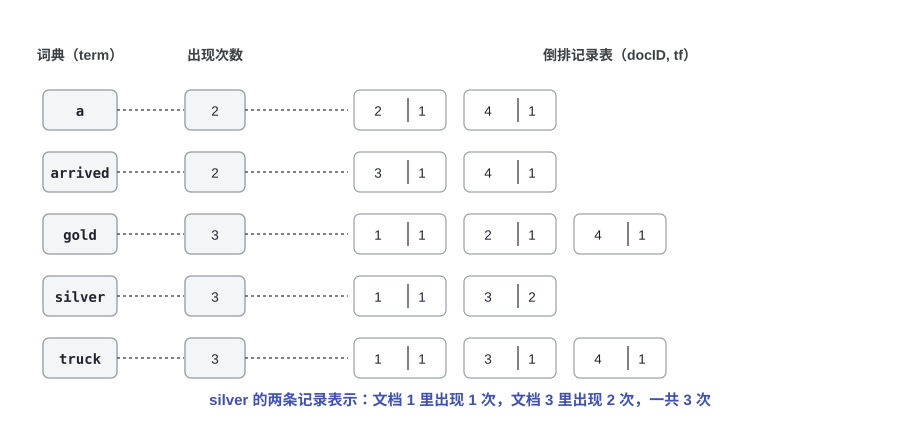
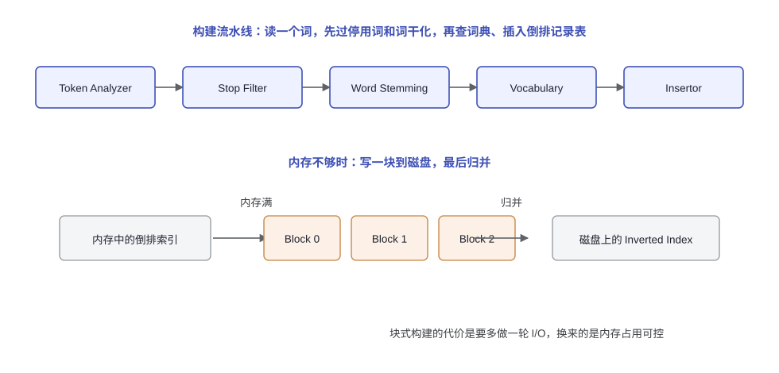
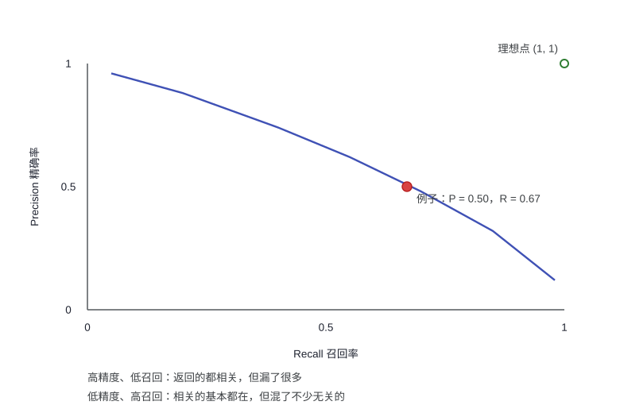

# 第三讲：倒排索引（Inverted File Index）

> 上一讲的红黑树、B+ 树解决的是"在一组 key 里快速找一个"。这一讲换了个问题：给定一个词，怎么立刻找出所有包含它的文档？这就是搜索引擎的第一块地基。答案是倒排索引：把"文档里有哪些词"翻过来，记成"每个词出现在哪些文档里"。

---

## 1. 从逐页扫描到倒排索引

### 1.1 问题

想找出所有同时含有 `Computer` 和 `Science` 的网页。最直接的做法是逐页扫描，但 Google 在 2020 年前后的索引规模大约是 4000 亿个页面，这个量级下扫描一遍的成本无法接受。

所以需要的是一个反过来的结构：不是"给定文档找词"，而是"给定词找文档"。

### 1.2 方案一：文档-词项关联矩阵

先把文档和词项的关系写成一个矩阵：每行一个词，每列一篇文档，某篇文档含有某个词就在交叉处写 1。用 4 篇文档举个例子：

| 文档 | 内容 |
|------|------|
| 1 | Gold silver truck |
| 2 | Shipment of gold damaged in a fire |
| 3 | Delivery of silver arrived in a silver truck |
| 4 | Shipment of gold arrived in a truck |

把出现的词（忽略大小写）整理出来，按文档编号得到 11 个行向量：

| term | doc1 | doc2 | doc3 | doc4 |
|------|------|------|------|------|
| a | 0 | 1 | 0 | 1 |
| arrived | 0 | 0 | 1 | 1 |
| damaged | 0 | 1 | 0 | 0 |
| delivery | 0 | 0 | 1 | 0 |
| fire | 0 | 1 | 0 | 0 |
| gold | 1 | 1 | 0 | 1 |
| of | 0 | 1 | 1 | 1 |
| in | 0 | 1 | 1 | 1 |
| shipment | 0 | 1 | 0 | 1 |
| silver | 1 | 0 | 1 | 0 |
| truck | 1 | 0 | 1 | 1 |

查 `silver AND truck` 就是两个位向量按位与：

```text
silver   1 0 1 0
truck    1 0 1 1
AND    ---------
         1 0 1 0   →  文档 1 和 3
```

矩阵的好处是布尔查询可以变成位运算，坏处是绝大部分格子都是 0。真实语料里词表有几百万个、文档有几十亿篇，这个矩阵根本存不下，也不能指望它落在内存里。

### 1.3 方案二：倒排索引

只记非零的位置，就得到倒排索引：

- 词典（dictionary / vocabulary）：所有出现过的词；
- 倒排记录表（posting list）：这个词出现过的文档编号，通常还带上词频。

上面 4 篇文档的索引（第一列是总出现次数，后面是 docID 和该文档内的词频）：

| term | times | posting list |
|------|-------|--------------|
| a | 2 | (2,1) (4,1) |
| arrived | 2 | (3,1) (4,1) |
| damaged | 1 | (2,1) |
| delivery | 1 | (3,1) |
| fire | 1 | (2,1) |
| gold | 3 | (1,1) (2,1) (4,1) |
| of | 3 | (2,1) (3,1) (4,1) |
| in | 3 | (2,1) (3,1) (4,1) |
| shipment | 2 | (2,1) (4,1) |
| silver | 3 | (1,1) (3,2) |
| truck | 3 | (1,1) (3,1) (4,1) |



`silver` 那行表示：文档 1 里出现 1 次，文档 3 里出现 2 次，一共 3 次。

两个常见问题：

- 怎么把含有某个词的句子打印出来、并把词高亮？光有 docID 不够，还需要在 posting 里存位置信息（第几段、第几句、句内第几个词），这也是支持短语查询和邻近查询的前提。
- 为什么要存词频（times）？检索结果要排序，词频是最基本的打分依据之一；`tf` 也可以直接放在每条 posting 里。

---

## 2. 索引是怎么建出来的

### 2.1 生成器

思路很直白：逐篇读文档，逐词查词典，查到就把当前文档追加到它的倒排记录表里。

```text
while (读入一篇文档 D) {
    while (读入 D 里的一个词 T) {
        if (Find(Dictionary, T) == false)
            Insert(Dictionary, T);
        Get T's posting list;
        Insert a node to T's posting list;
    }
}
把倒排索引写回磁盘;
```

工程上这条链会拆成几个环节：



分词器（token analyzer）把文本切词，停用词过滤（stop filter）丢掉没有检索价值的词，词干化（word stemming）把词还原成词根，然后查词典（vocabulary）、插入倒排记录表（insertor）。标着内存管理的那一块，说的是下面 3.1 到 3.3 要处理的问题。

### 2.2 词干化与停用词

词干化只保留词根，`says`、`said`、`saying` 归到 `say`，`process`、`processing`、`processed`、`processes` 归到 `process`。这样同一个词的不同形态只占一条 posting，检索时也不会因为换了时态就漏掉。

停用词（stop words）是另一类省事的地方：`a`、`the`、`it` 这类词几乎每篇文档都有，索引它们既占空间又拉长 posting list，直接丢掉。代价是查 `to be or not to be` 这种查询会失真，所以停用词表要按场景挑。

### 2.3 词典用什么装

访问一个词，本质是在词典里做查找，两种常见选择：

- 搜索树：B 树、B+ 树、Trie 等，支持范围查询和前缀查询（`comp*` 这类），代价是查找要 $\log$ 级别；
- 哈希：查找平均 $O(1)$，但范围查询、前缀查询做不了，也没法按字典序遍历。

搜索引擎的词典经常两种都用：哈希负责精确查找，另外维护一份有序结构支持前缀和范围。

---

## 3. 索引怎么落到磁盘上

### 3.1 内存版：一次装不下的教训

最直接的做法是全程在内存里维护倒排记录表，读完再写盘。用一组真实规模的数字看看会发生什么：5GB 文本、50 万篇文档、8 亿个词、4 亿条 posting entry。

一条未压缩的 entry 大致是 docID（4 字节）+ tf（2 字节）+ 指向下一条的指针（4 字节）= 10 字节，4 亿条就是 4GB 内存。如果机器只有 40MB 可用内存，这条路直接走不通：一旦开始换页，性能就崩了。这份材料里还有一句对比：把 posting list 直接放在磁盘上，估算要跑六个星期。

好处也不能不提：内存版算法简单、速度快，5GB 的集合大约六个小时能建完，适合小规模集合。

### 3.2 排序版：外部排序 + 归并

装不下就分批：先把文本变成一条条三元组，再用外部归并排序把同样的词聚到一起。

1. 解析文档，边解析边给词编号，往临时文件里写 `<termID, docID, tf>`；
2. 每次读满内存就排序，写成一个有序的 run；
3. 把若干个 run 归并成一个；
4. 顺着排好序的三元组生成倒排索引。

还是那组数字：4 亿条三元组、40MB 内存，一次能放 400 万条，也就是 100 个 run；归并要 $\lceil \log_2 100 \rceil = 7$ 趟。分阶段耗时大致是：解析 5 小时、写临时文件 0.5 小时、排序 4 小时、归并 9 小时、最后生成索引 1.5 小时，合计约 20 小时。代价是临时文件要占掉两倍文本大小的磁盘空间。

### 3.3 块式构建

介于两者之间的做法：内存写满就把当前这块索引写到磁盘（BlockIndex），最后把所有块和主索引合并。前面流水线图里那条"内存满就写块"的分支说的就是这个，代价是多一轮 I/O，换来内存占用可控。

### 3.4 分布式索引

当文档集合大到一台机器装不下时，把索引切到多台机器上，有两种切法：

- 按词切（term-partitioned）：每台机器负责一部分词，比如 A~C、D~F 一直到 X~Z。查 `computer science` 时只需要问 `computer` 和 `science` 所在的那两台。
- 按文档切（document-partitioned）：每台机器负责一部分文档，比如第 1 万篇到第 2 万篇。查询要发给所有机器，再把各自的结果合并、按权重排序。

按词切的好处是查询只碰少数机器，坏处是负载不均（热门词所在的机器会被压垮）；按文档切负载均衡，但每次查询都要全量广播。底层存储本身也是分布式系统的问题，课程材料里给的参考是 Google File System 那篇论文。

### 3.5 动态索引

文档是不断进出的：新文档要追加 posting 或者加新词，旧文档要删除。常见做法是维护一个小的辅助索引（auxiliary index）装新来的文档，攒到一定规模再和主索引（main index）合并；删除可以先打标记，等重建的时候再真正清掉。什么时候触发合并、删除怎么处理，是工程上要权衡的两件事。

---

## 4. 压缩

### 4.1 索引里有哪些数

要压缩的东西有三类：词典里的词本身、每条 posting 的 docID、以及 tf（要支持邻近查询还有位置）。其中 docID 占大头，因为词表再大也只有几百万条，而 posting 有几亿条。

### 4.2 先看看数据分布

几个能解释"为什么压缩有用"的统计：

- 停用词能砍掉大约一半的索引体积，`the` 一个词就占了英文文本约 7%；
- 一半的词只出现一次（hapax legomena），它们的 posting list 只有一条；
- 但另一头有超级长的 posting：Excite 搜索引擎 1997 年统计 `occurs` 一个词出现了 700 万次。

所以压缩的重点是"绝大多数数字都很小，只有少数很大"，编码方案要照顾小数字。

### 4.3 差分编码

posting list 里的 docID 是递增的，存差值比存原值划算：

```text
docID:  4   10   20   30   35
gap:     4    6   10   10    5
```

差值通常比原值小得多，用更少的位就能表示。极端情况下，一个词连续出现在相邻文档里，差值就是 1。

### 4.4 Elias 编码与变长向量编码

Elias γ 编码把一个正整数写成三段：$\lfloor \log_2 x \rfloor$ 个 1、一个 0、然后是余数 $x - 2^{\lfloor \log_2 x \rfloor}$ 的二进制。例子里 $9 = 8 + 1$，所以是 `111` `0` `001`，共 7 位。位数是 $2\lfloor \log_2 x \rfloor + 1$，数字越小越省。

更一般的是选一个向量 $V = \langle b, 2b, 4b, \dots \rangle$：

1. 找到最小的 $k$，让 $V$ 前 $k$ 项之和不小于 $x$；
2. 把 $k-1$ 用一进制写出来；
3. 写一个 0 作分隔；
4. 把 $x - \sum_{i<k} V_i - 1$ 用 $\lceil \log_2 V_k \rceil$ 位二进制接上。

拿差值 $4, 6, 10, 10, 5$ 试一下，取中位数 $b = 10$，$V = \langle 10, 20, 30, 40 \rangle$：

| gap | $k$ | 一进制 | 分隔 | 余数（4 位） | 位数 |
|-----|-----|--------|------|--------------|------|
| 4 | 1 | 空 | 0 | 0011 | 5 |
| 6 | 1 | 空 | 0 | 0101 | 5 |
| 10 | 1 | 空 | 0 | 1001 | 5 |
| 10 | 1 | 空 | 0 | 1001 | 5 |
| 5 | 1 | 空 | 0 | 0100 | 5 |

一共 25 位；同样这组数用 Elias γ 编码要 $5 + 5 + 7 + 7 + 5 = 29$ 位。$b$ 取每个 posting list 差值的中位数，就是让大规模的数字尽量落在第一个区间里。

### 4.5 字节对齐编码

另一种省事的做法是让编码按字节对齐，用开头两位表示后面还有几个字节：

| 前缀 | 总长度 | 能表示的范围 |
|------|--------|--------------|
| 00 | 1 字节 | 0 ~ 63 |
| 01 | 2 字节 | 64 ~ 16K |
| 10 | 3 字节 | 16K ~ 4M |
| 11 | 4 字节 | 4M ~ 1G |

好处是解码时不用做位运算，按字节读就行，工程里很常见。

### 4.6 截断（top docs）

还有一种"压缩"是干脆不存全部：为每个词单独维护一份按权重排好、只留前 $x$ 篇文档的截断 posting list。查询时先看这份短表，需要再回原表。

好处是省掉了长 posting list 的 I/O，坏处是布尔查询没法做（`AND` 需要完整的文档集合），也可能漏掉本来相关的文档。所以它一般用在不要求严格布尔语义的场景。

### 4.7 压缩的代价

压缩换来的是更小的索引和更少的 I/O，代价是构建更慢、代码更复杂、查询时要解压。经验上解压那点开销通常能被省下来的 I/O 抵消掉，但"索引缩小到数据库的 10%~15%"这种收益不是白来的。

---

## 5. 检索效果怎么衡量

### 5.1 四个维度

| 维度 | 具体指标 |
|------|----------|
| 建索引的速度 | 每小时处理多少文档 |
| 检索的速度 | 延迟随索引规模的变化 |
| 查询语言的表达力 | 能表达多复杂的需求，复杂查询下还快不快 |
| 用户满意度 | 响应时间、索引占用的空间，以及结果到底相不相关 |

前两项是系统指标，第四项里"相不相关"要另外一套方法来量。

### 5.2 Precision 与 Recall

衡量相关性需要三样东西：一个标杆文档集合、一组标杆查询、以及每个"查询-文档"对的二元判定（相关 / 不相关）。然后按"有没有被检索出来"和"是不是相关"交叉，得到四类：

| | 相关 | 不相关 |
|------|------|--------|
| 被检索出来 | 4 | 4 |
| 没被检索出来 | 2 | 10 |

这张表对应的例子是：集合里 20 篇文档，其中 6 篇相关；系统返回了 8 篇，里面 4 篇相关。两个指标分别是

$$P = \frac{\text{检索出的相关文档}}{\text{检索出的文档}} = \frac{4}{4+4} = 0.50$$

$$R = \frac{\text{检索出的相关文档}}{\text{所有相关文档}} = \frac{4}{4+2} \approx 0.67$$

精确率（precision）关心"返回的东西有多干净"，召回率（recall）关心"该找的找回来多少"。两者通常此消彼长：把门槛放宽，召回率上去、精确率下来；收窄则相反。

### 5.3 P-R 曲线

把不同阈值下的 $(R, P)$ 连起来，就得到 P-R 曲线。理想情况是右上角 $(1,1)$ 那个点，实际系统都落在曲线下方：



上面那个例子的点落在 $(0.67, 0.50)$。曲线的两端也各有名字：靠左上的一端"返回的都相关，但漏了很多"，靠右下的一端"相关的基本都在，但混了不少无关的"。

### 5.4 阈值截断

最后是两种工程上的截断手段：

- 文档侧：只取权重最高的前 $x$ 篇。省 I/O，但布尔查询用不了，也可能因为截断漏掉相关文档。
- 查询侧：把查询词按在集合里出现的频率升序排（越少见的词越有区分度），只取其中一部分去检索。这样能避开那些超长的 posting list；只要不砍得太狠，效果通常不会明显变差。

---

## 6. 小结

倒排索引把"文档 → 词"翻成"词 → 文档"：词典存词项，倒排记录表存 docID、词频和（可选的）位置。构建时先分词、去停用词、做词干化，再查词典插 posting；内存装不下就分块写盘再归并，或者干脆用外部排序生成；规模再大就按词或按文档切到多台机器上，并维护辅助索引来应对不断更新的文档。为了让索引变小，docID 用差分编码，差值再用 Elias 或变长编码压一压；衡量效果则看精确率和召回率。

这一讲配套的项目是写一个迷你搜索引擎，语料是莎士比亚全集（[shakespeare.mit.edu](http://shakespeare.mit.edu/)）：建词典、去停用词、做词干化、生成倒排索引，再支持几个查询。停用词表和词干化算法都可以找现成的实现，重点是把索引这条链路走通。

## 参考资料

1. 课程材料：《Building an Inverted Index》（内存版、排序版索引构建与耗时估算）、《Compression》（差分编码、Elias 编码、字节对齐编码、top docs）、《Inverted Index Construction》、《The Google File System》。
2. S. Ghemawat, H. Gobioff, S.-T. Leung, *The Google File System*, SOSP 2003.
3. C. D. Manning, P. Raghavan, H. Schütze, *Introduction to Information Retrieval*, Cambridge University Press, 2008（索引构建、压缩、precision/recall 的标准参考）。
