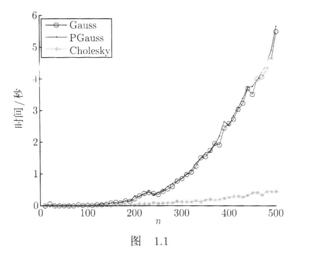

# Cholesky 分解在不同平台上的性能异常

> 一个其实很不严谨的对比测试hhh

> 在实现数值代数课程的算法时，我发现 Cholesky 分解在 macOS 上的表现与教材的结论截然相反，于是就有了这篇分析。

## 教材结论

教材图 1.1 的基准测试显示，Cholesky 的耗时远低于 Gauss 消元法和列主元 Gauss 消元法的，n 越大差距越明显。理论复杂度也支持这一点：Cholesky 的时间复杂度大约是 $O(\frac{n^3}{3})$，Gauss 是 $O(\frac{2n^3}{3})$，浮点运算量少了一半。



## 测试方式

### 随机数设置

为保证数据生成的随机性，我们将随机数种子设置为

```cpp
srand(time(0));
```

### 数据生成

对于 $n * n$ 的正定矩阵 $A$，$A = L L^T$，其中 $L$ 是一个随机生成的下三角矩阵，$L$ 的元素是服从区间 $[1, 2]$ 上的均匀分布的随机数。

对于 $n$ 维的向量 $b$，元素是服从区间 $[0, 1]$ 上的均匀分布的随机数。

### 耗时测试

我们在调用求解函数前后分别记录时间，从而计算出求解函数的耗时。

```cpp
clock_t start = clock();
/* 调用相应的求解函数 */
clock_t end = clock();
double time_SOLVE = static_cast<double>(end - start) / CLOCKS_PER_SEC;
```

## 测试结果

我们只关注 gaussSolve、PgaussSolve 和 choleskySolve 的数据。

### macOS

**测试环境**: MacBook Air M3，Apple Clang 17.0.0

.png)

从图上能够看出，Gauss（蓝线） 和 Pgauss（橙线） 的耗时非常接近，而 Cholesky（绿线） 的耗时竟然比 Gauss 还高。

一开始我以为是代码实现有问题，但仔细检查了算法实现，确认没有错误。于是我决定在 Linux 系统上也跑一下同样的代码。

### Linux

**测试环境**： Debian GNU/Linux 13 (trixie) aarch64，GCC 14.2.0 \
其中硬件为 Raspberry Pi 5 Model B Rev 1.1

.png)

这个结果完全符合教材的结论，Cholesky 的耗时明显低于 Gauss。

### 结果比较

比较 $n=2000$ 时的数据：

| 算法 | Debian | Mac |
|------|--------|-----|
| gaussSolve | 5.576s | 0.509s |
| PgaussSolve | 5.502s | 0.501s |
| choleskySolve | 1.790s | 0.852s |

树莓派上 Cholesky 比 Gauss 快 3 倍，跟教材结论大致一致。但 M3 上 Cholesky 反而比 Gauss 慢了 1.67 倍，跟教材的结论完全相反。

## 原因探究

### 编译器不同

我一开始是怀疑编译器不同导致的性能差异。树莓派上用的是 GCC，Mac 上用的是 Apple Clang。于是在 Mac 上换成了 GCC 13 进行编译运行：

| $n=2000$ | Clang -O2 | GCC-13 -O2 |
|--------|-----------|-------------|
| gaussSolve | 0.509s | 0.810s |
| choleskySolve | 0.852s | 1.300s |

结果发现，换成 GCC 后 Gauss 变慢了，但 Cholesky 也变慢了，并且还是比 Gauss 慢。

接着在 M3 上又试了 Clang `-O3`，结果跟 `-O2` 基本没差别，可以排除优化级别的问题。

**结论**：Apple Clang 相比 GCC 对 Gauss 的行连续循环做了更激进的优化，而 Cholesky 的列跳跃访问本身就难以被 SIMD 向量化，导致 Gauss 的耗时反而比 Cholesky 更低。

### 内存访问模式

既然换了编译器和优化级别都无法让 Cholesky 反超 Gauss，那问题可能出在代码本身。翻了一下代码，发现关键在 Matrix 的存储方式和各算法的循环结构上。

Matrix 用的是行主序（`data[i * n + j]`），同一行在内存里是挨着的。

Gauss 消元的内层循环：

```cpp
for (j = k; j < n; ++j)
    U(i, j) -= factor * U(k, j);  // U(k, j) 在同一行，步长=1
```

j 每次加 1，访问的是同一行相邻的元素，内存连续，CPU 预取器工作得很舒服。

但 Cholesky 的内层循环：

```cpp
for (k = 0; k < j; ++k)
    sum += L(i, k) * L(j, k);  // 地址步长=n，每次跳一整行
```

k 每次加 1，但 `L(i, k)` 的地址是 `data[i*n + k]`，步长是 n。n=2000 的时候每次跳 16000 字节，缓存根本跟不上。

所以 Gauss 的循环天然缓存友好，Cholesky 天然不友好。理论上 Cholesky 算得少，但实际花在等内存上的时间把优势吃掉了。

而 Apple Clang 对自家 ARM 芯片的 SIMD 向量化做了很深的优化，Gauss 那种规整的行连续循环被充分向量化，进一步放大了缓存优势。Cholesky 的列跳跃访问模式不适合 SIMD，也就没法从中受益。反观 GCC 在树莓派的 Cortex-A76 上比较保守，向量化没那么激进，两种算法的表现更接近理论值，Cholesky 的复杂度优势才得以体现。

## 总结

教材的结论没错，Cholesky 理论上确实更快。但教材没提的是，实际运行时间不仅取决于运算量，还与内存访问模式、编译器优化策略和 CPU 微架构等有关。在 Apple Silicon + Apple Clang 的组合下，Gauss 的行连续内存访问刚好被硬件和编译器充分利用，Cholesky 的理论优势反而被盖过去了。

### 可能的优化方案

1. 用列主序单独存储 L，让点积的内层循环变成连续访问
2. 做 cache blocking，把矩阵分块计算
3. 直接调 BLAS（比如 Mac 上用 Accelerate 框架），里面已经处理好了这些优化
4. 手动加预取指令或者循环展开
